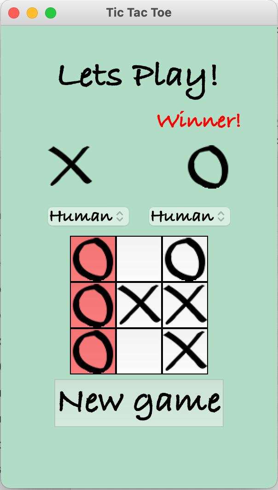

# TicTacToe
It's my simple TicTacToe game implementation.<br>
You can play vs another human or AI.<br>

<div align="left">
     
</div>

# Installation
- install python 3.8
- in working directory run:

```
git clone https://gitlab.com/ead3471/tictactoe.git
cd tictactoe
virtualenv -p python3.8 venv
python main.py

```
